# DJournal - Never forget your ideas

Djournal is an android application which lets you create journals in which you can save written notes, voice recordings
and drawings.

  

## Table of contents

* [General info](#general-info)
* [Technologies](#technologies)
* [3 Party Libraries](#3 Party Libraries)
* [Setup](#Setup)
* [Usage](#Usage)

  

## General info

This project is part of the study course Mobile Application Development (MAD) with the purpose of getting a deeper
understanding in the development of android mobile applications.

## Technologies

Project is created with:

## 3 Party Libraries

This project uses the following third party libraries

* Pdf generator https://github.com/UttamPanchasara/PDF-Generator?
* Floating action button speed dial https://github.com/leinardi/FloatingActionButtonSpeedDial?
* Color picker https://github.com/aziztitu/AndroidPhotoshopColorPicker
* RichTexteditor https://github.com/wasabeef/richeditor-android

The voice recorder was build with the help of https://www.youtube.com/channel/UCfHSrN68OiYgjl7aiyHYTMg

## Setup

To run this project, run it either:

* locally with android studio on an emulated android device  
  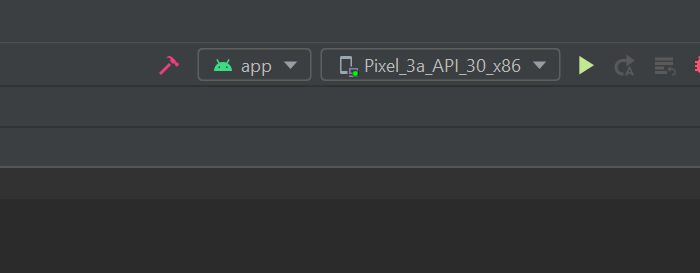
* on your own android mobile device with android studio  
  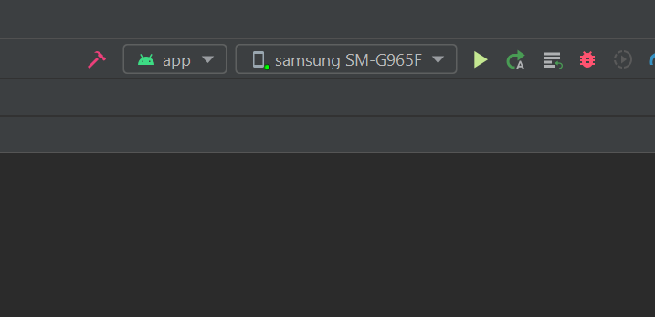
* or by creating an apk file and installing on you mobile android device
  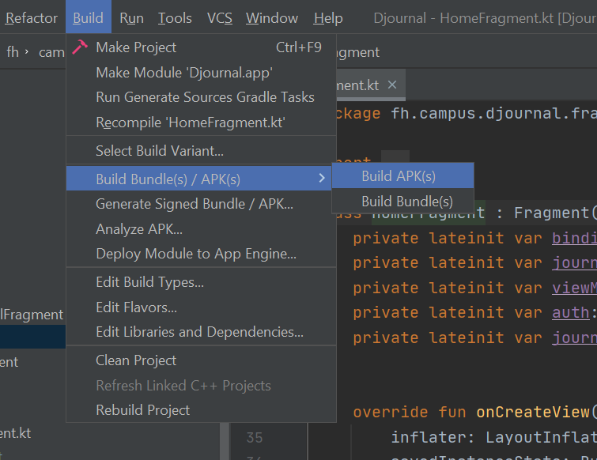
  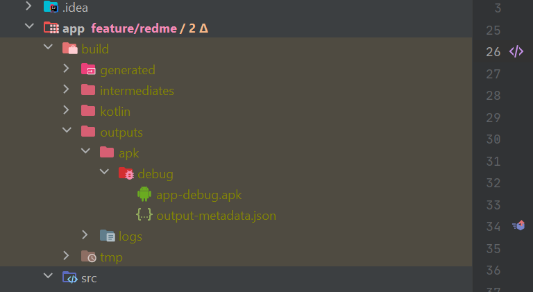
  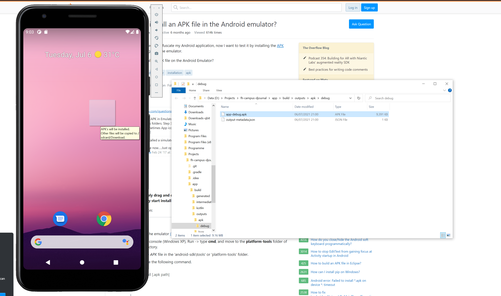

## Usage

After registering just log in with your credentials and start writing notes :)

### Create a Journal

* To create a journal just click the floating action button in the home screen  
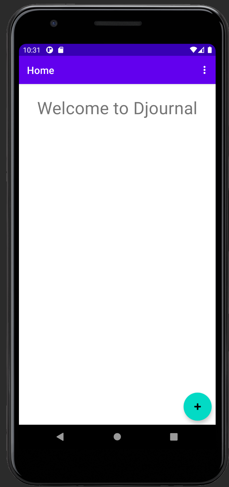  
* give your new journal a name and description  
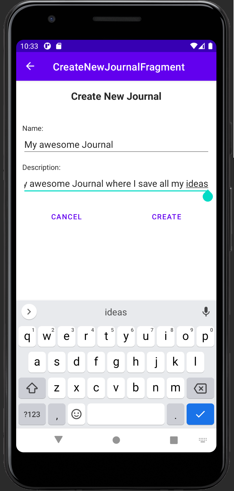

* and you are ready to fill it with notes  
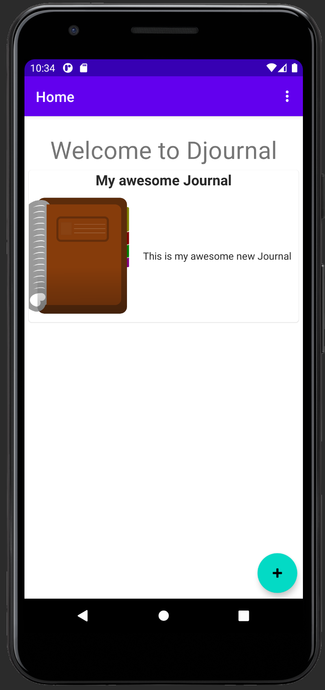  
  
### Create a written note  

* To create a new written note just click the floating action button, in the view that appears after you click on a journal, and click the icon to create a new written note    
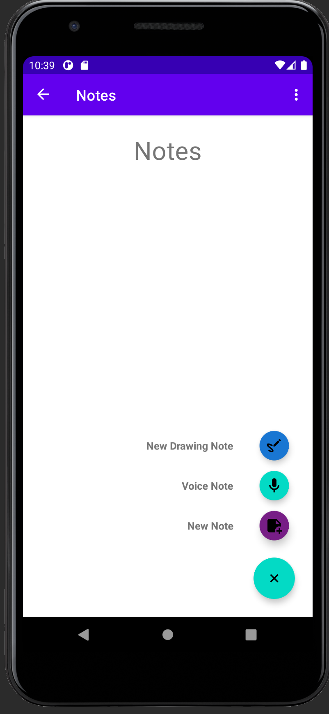
* Write down your awesome idea  
  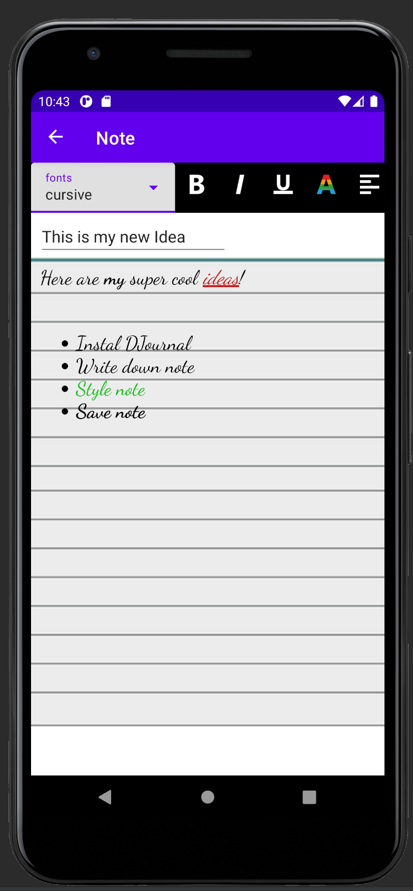
* Save it  
  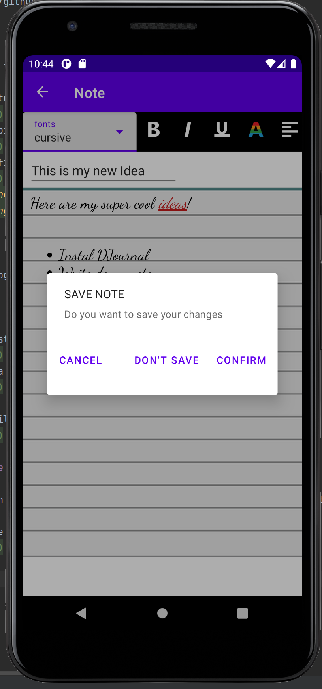
* And view it later to update or delete it  
  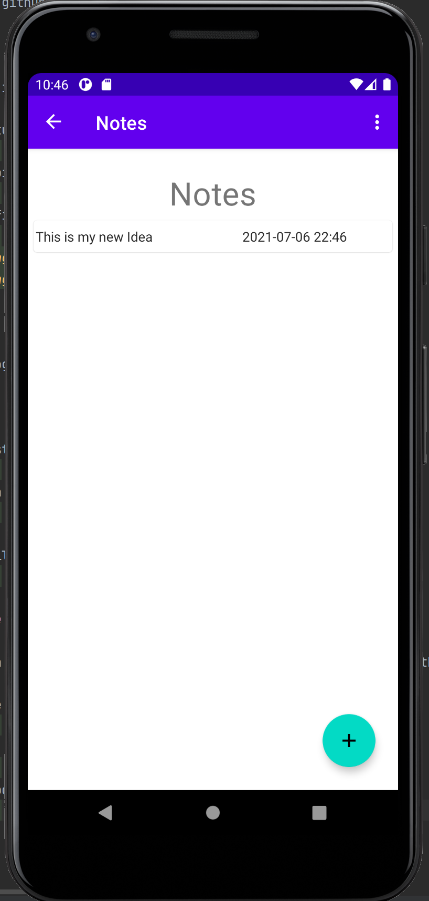  
  
### Create a voice recoded note  

* To create a voice recorded note just click the floating action button, in the view that appears after you click on a journal, and click the icon to create a new voice recorded note  
  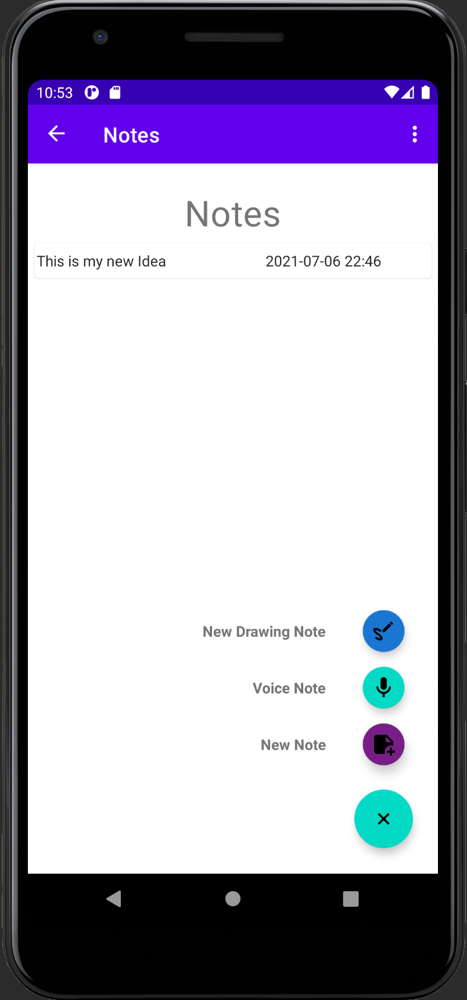
* Start the recording and record your important ideas  
  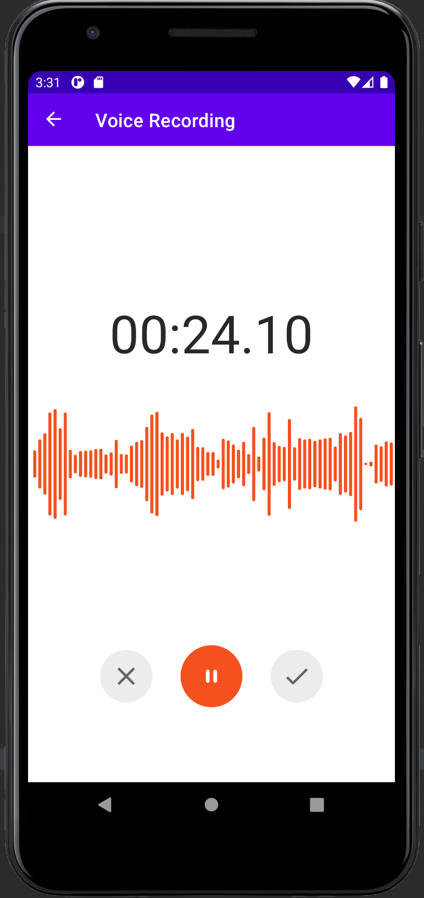
* Save it for later  
  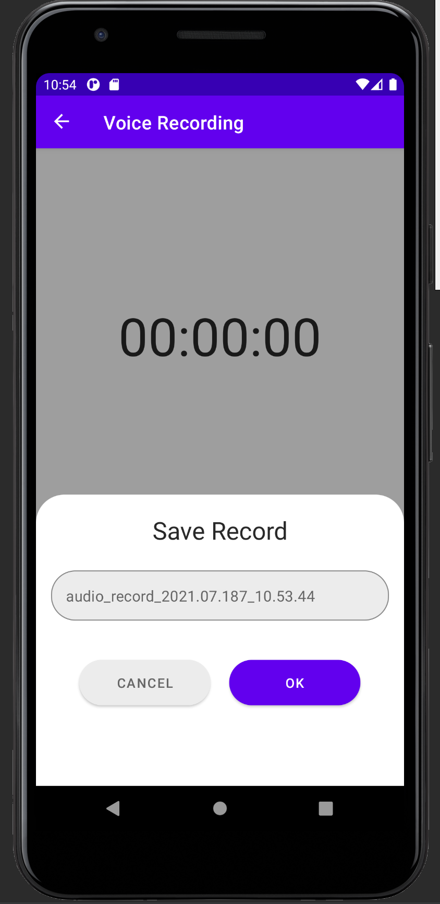
* And listen to it again  
  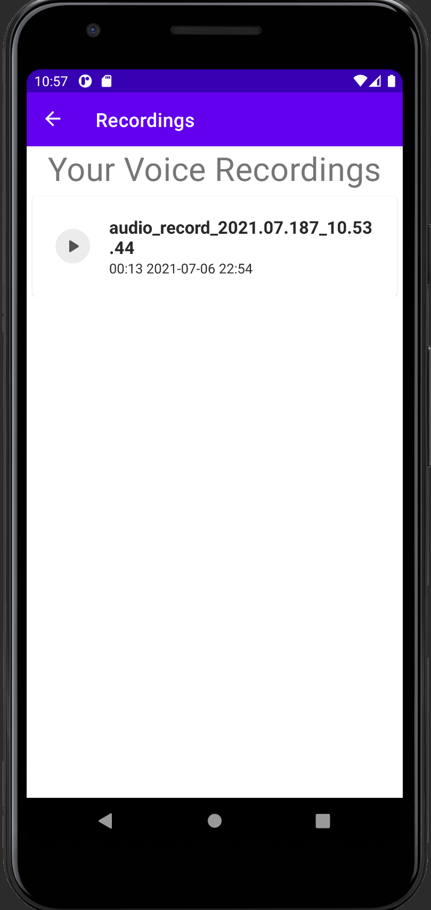

### Create a freehand note  
TODO  

### Print or share your written note to let others see your awesome ideas  
* Click longer on the written note you want to print  
  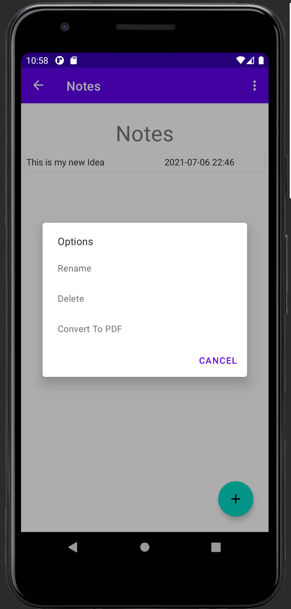
* Select Convert to PDF  
  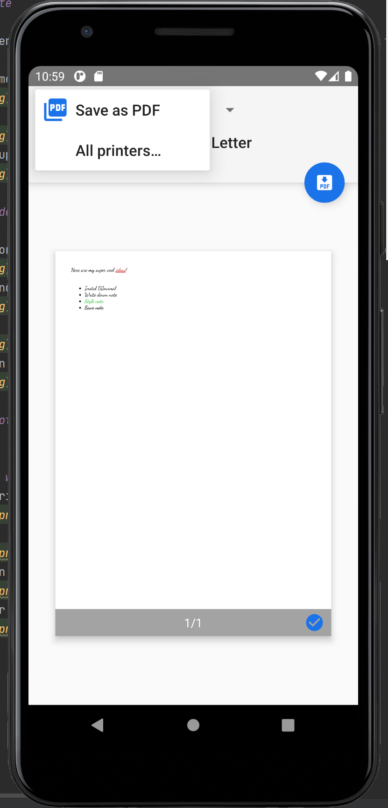
* Print it or save it in your download folder  
  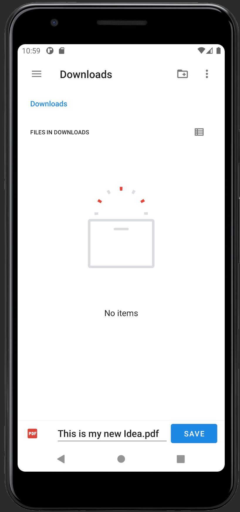
* And share it with your friends  
  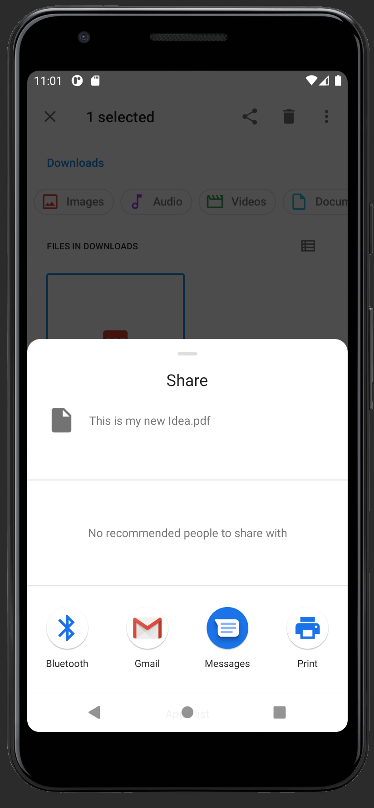

