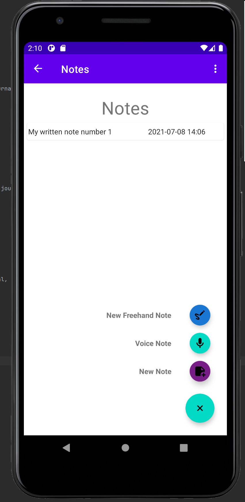
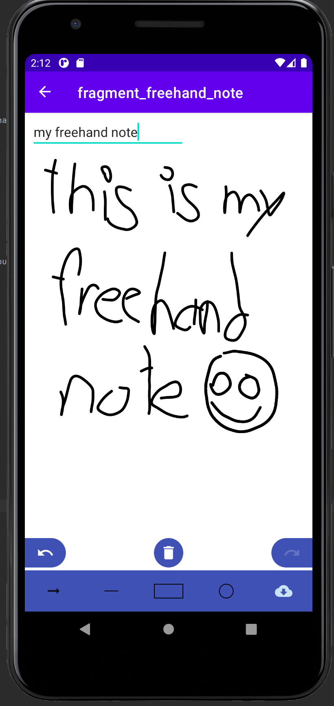
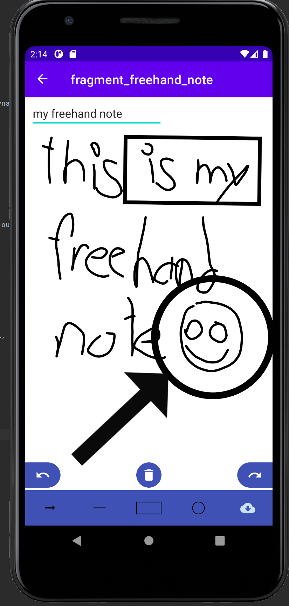
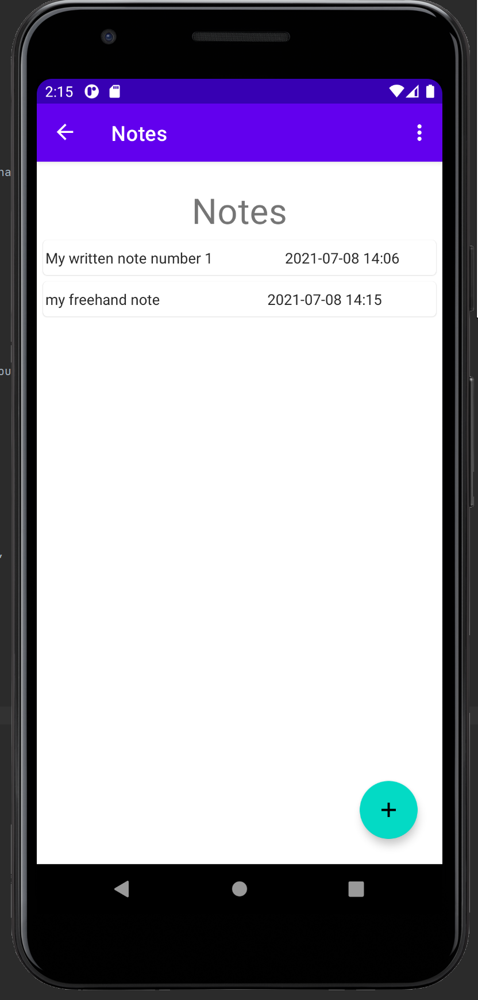

# DJournal - Never forget your ideas

Djournal is an android application which lets you create journals in which you can save written notes, voice recordings
and drawings.  

## Table of contents

* [General info](#general-info)
* [Technologies](#technologies)
* [3th-Party-Libraries](#3th-Party-Libraries)
* [Setup](#Setup)
* [Usage](#Usage)
    * [create a journal](#Create-a-journal)
    * [create a written note](#create-a-written-note)
    * [create a voice recorded note](#create-a-voice-recorded-note)
    * [create a freehand note](#create-a-freehand-note)
    * [Print or share your written note to let others see your awesome ideas](#Print-or-share-your-written-note-to-let-others-see-your-awesome-ideas)

  

## General info

This project is part of the study course Mobile Application Development (MAD) on the FH-Campus Vienna with the purpose of getting a deeper
understanding in the development of android mobile applications.  
In no form is any monetization or commercialisation off this application intended!

## Technologies

Project is created with:  
* Android Studio  
* Android SDK 21
* Kotlin  

## 3rd-Party-Libraries

This project uses the following third party libraries

* Pdf generator https://github.com/UttamPanchasara/PDF-Generator?
* Floating action button speed dial https://github.com/leinardi/FloatingActionButtonSpeedDial?
* Color picker https://github.com/aziztitu/AndroidPhotoshopColorPicker
* RichTexteditor https://github.com/wasabeef/richeditor-android
* CanvasEditor https://github.com/outsbook/canvaseditor

The voice recorder was build with the help of https://www.youtube.com/channel/UCfHSrN68OiYgjl7aiyHYTMg

## Setup

To run this project, run it either:

* locally with android studio on an emulated android device  
  
* on your own android mobile device with android studio  
  
* or by creating an apk file and installing on you mobile android device
  
  
  

## Usage

After registering just log in with your credentials and start writing notes :)

### Create a Journal

* To create a journal just click the floating action button in the home screen  
* give your new journal a name and description  
* and you are ready to fill it with notes  

     
     
     

  
### Create a written note  

* To create a new written note just click the floating action button, in the view that appears after you click on a journal, and click the icon to create a new written note    
* Write down your awesome idea  
* Save it  
* And view it later to update or delete it  

     
     
     
     

  
### Create a voice recoded note  

* To create a voice recorded note just click the floating action button, in the view that appears after you click on a journal, and click the icon to create a new voice recorded note  
* Start the recording and record your important ideas  
* Save it for later  
* And listen to it again  

     
     
     
     

  

### Create a freehand note  
* To create a freehand note just click the floating action button, in the view that appears after you click on a journal, and click the icon to create a new freehand note  
* Use your finger or a special pen to write and draw your freehand note  
* Add shapes to make it even more personalized  
* Save it by clicking the cloud symbol or by navigating back  
* And view it later, update or delete it  

     
     
     
     

### Print or share your written note to let others see your awesome ideas  
* Click longer on the written note you want to print  
* Select Convert to PDF  
* Print it or save it in your download folder  
* And share it with your friends  

     
     
     
       

